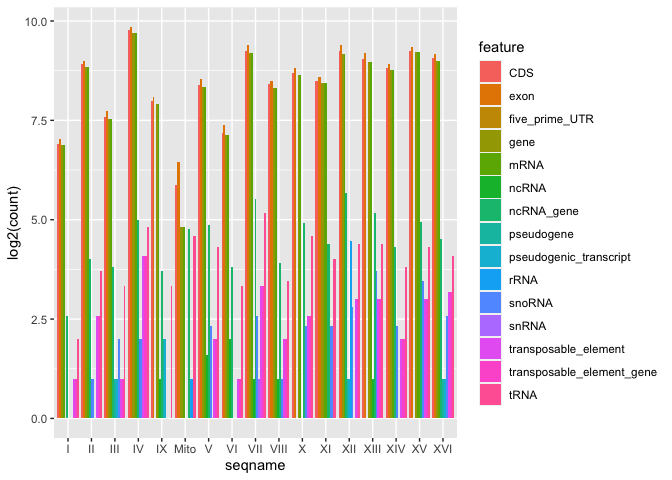
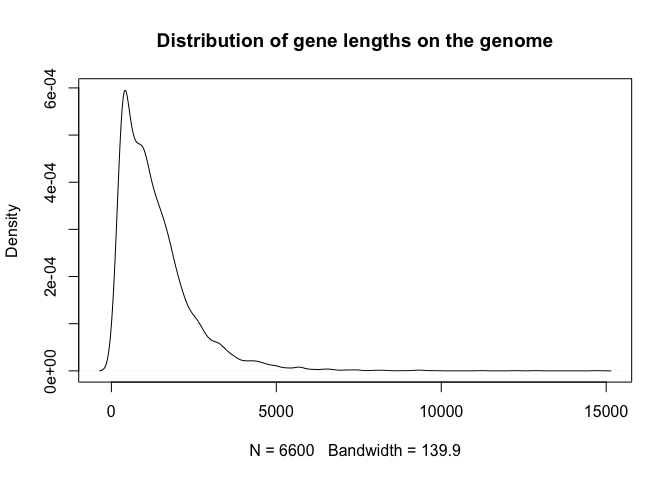
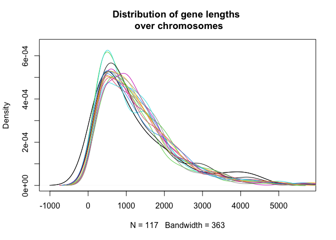
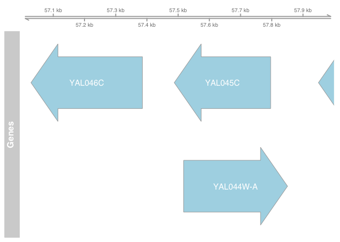
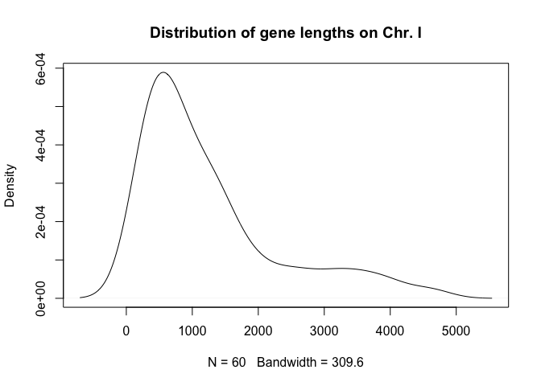

## GFF

The General Feature Format ([GFF](https://www.ensembl.org/info/website/upload/gff.html)) file has nine columns:  
  
  
| colname | description |
|---|---|
| seqname | The name of the sequence; must be a chromosome or scaffold. |
| source | The program that generated this feature. |
| feature | The name of this type of feature, e.g. "CDS", "start_codon", "stop_codon", and "exon" |
| start | The starting position of the feature in the sequence; the first base is numbered 1. |
| end | The ending position of the feature (inclusive). |
| score | A score between 0 and 1000. |
| strand | Valid entries include "+", "-", or ".". |
| frame | If the feature is a coding exon, frame should be a number between 0-2 that represents the reading frame of the first base. If the feature is not a coding exon, the value should be ".". |
  
Dependencies

```r
library(dplyr)
library(tibble)
library(ggplot2)
library(stringr)
library(rtracklayer)
library(Gviz)
```
Point to the GFF file 

```r
gff_file <- "../dat/Saccharomyces_cerevisiae_genome.gff3"
```


Read GFF file as dataframe

```r
gff = read.delim(gff_file, header=F, comment.char="#", 
                 col.names = c("seqname", "source", "feature", "start", "end", 
                               "score", "strand", "frame", "group"))
gff <- gff  %>% as_tibble()
```

### Summarize features in GTF file

```r
gff %>% 
  count(feature, sort = TRUE)
```

```
## # A tibble: 16 x 2
##    feature                       n
##    <chr>                     <int>
##  1 exon                       7507
##  2 CDS                        6913
##  3 gene                       6600
##  4 mRNA                       6600
##  5 ncRNA_gene                  424
##  6 tRNA                        299
##  7 transposable_element         91
##  8 transposable_element_gene    91
##  9 snoRNA                       77
## 10 rRNA                         24
## 11 ncRNA                        18
## 12 chromosome                   17
## 13 pseudogene                   12
## 14 pseudogenic_transcript       12
## 15 snRNA                         6
## 16 five_prime_UTR                4
```

```r
gff %>% 
  group_by(seqname, feature) %>% 
  summarize(count = n()) %>%
  ungroup() %>% 
  filter(feature != "chromosome") %>% 
  ggplot(aes(x = seqname, y = log2(count))) +
  geom_bar(aes(fill = feature), stat = 'identity', position = 'dodge')
```

<!-- -->

### Number of genes on each sequence


```r
gff %>% 
  group_by(seqname) %>% 
  filter(feature == "gene") %>% 
  count(feature)
```

```
## # A tibble: 17 x 3
## # Groups:   seqname [17]
##    seqname feature     n
##    <chr>   <chr>   <int>
##  1 I       gene      117
##  2 II      gene      456
##  3 III     gene      184
##  4 IV      gene      836
##  5 IX      gene      241
##  6 Mito    gene       28
##  7 V       gene      323
##  8 VI      gene      139
##  9 VII     gene      583
## 10 VIII    gene      321
## 11 X       gene      398
## 12 XI      gene      348
## 13 XII     gene      578
## 14 XIII    gene      505
## 15 XIV     gene      435
## 16 XV      gene      597
## 17 XVI     gene      511
```


### Genes in a specific genomic region 


```r
gff %>% 
  filter(seqname == "I", feature == "gene", 
               start > 57300, end < 58000)
```

```
## # A tibble: 2 x 9
##   seqname source feature start   end score strand frame group                   
##   <chr>   <chr>  <chr>   <int> <int> <chr> <chr>  <chr> <chr>                   
## 1 I       sgd    gene    57488 57796 .     -      .     ID=gene:YAL045C;biotype…
## 2 I       sgd    gene    57518 57850 .     +      .     ID=gene:YAL044W-A;Name=…
```

### Distribution of gene lengths

```r
feat_len <- gff %>% 
  transmute(seqname, feature, strand, len = end - start) %>% 
  filter(feature == "gene") %>% 
  pull(len)

plot(density(feat_len), main = 'Distribution of gene lengths on the genome')
```

<!-- -->

Distribution per chromosome

```r
Ilen <- gff %>% 
  transmute(seqname, feature, strand, len = end - start) %>% 
  filter(seqname == "I", feature == "gene" ) %>% 
  pull(len)

plot(density(Ilen), main = 'Distribution of gene lengths \n over chromosomes', 
     ylim = c(0, 6.5e-04 ))


lenchrs = sapply(1:16, function(i){
  chr = as.roman(i)
  gff %>% 
    transmute(seqname, feature, strand, len = end - start) %>% 
    filter(feature == "gene", seqname == as.character(chr)) %>% 
    pull(len)
  
})

for(i in seq(lenchrs)) {
  lines(density(lenchrs[[i]]), col = i)
}
```

<!-- -->


## Plotting genomic intervals

```r
# Extract gene_id in tidy format from 'group' 

gff_gr <- gff %>% 
  filter(feature == "gene") %>% 
  mutate(feat_id = str_sub(group, str_locate(group, ":")[,1]+1, str_locate(group, ";")[,1]-1))

gff_gr <- with(gff_gr, GRanges(seqname, IRanges(start, end), strand, id = feat_id))

genomic_ds <- gff_gr[seqnames(gff_gr) == "I"] # select chromosome

ref <- GRanges()
#library(Gviz)
ref_track <- GenomeAxisTrack()
options(ucscChromosomeNames=FALSE)
data_track <- AnnotationTrack(genomic_ds, name = "Genes", showFeatureId = TRUE)
plotTracks(c(ref_track, data_track),
           from = 57000, to = 58000)  # select coordinates
```

<!-- -->


-------------------------------------------------------------------------------


### Summarize features in GTF file


```r
gff_all = import.gff(con =  gff_file ,
                      colnames = c("type", "mycolums"))
table(gff_all$type)
```

```
## 
##                chromosome                      gene                      mRNA 
##                        17                      6600                      6600 
##                      exon                       CDS                ncRNA_gene 
##                      7507                      6913                       424 
##                     ncRNA                      tRNA                    snoRNA 
##                        18                       299                        77 
## transposable_element_gene      transposable_element                pseudogene 
##                        91                        91                        12 
##    pseudogenic_transcript                     snRNA            five_prime_UTR 
##                        12                         6                         4 
##                      rRNA 
##                        24
```

Load gene models from the GFF file. 

```r
gff_chromosome = import.gff(con = gff_file ,
                     feature.type = "chromosome",
                     colnames = c("type", "mycolums"))

gff_gene = import.gff(con = gff_file ,
                     feature.type = "gene",
                     colnames = c("type", "mycolums"))

gff_exon = import.gff(con = gff_file ,
                     feature.type = "exon",
                     colnames = c("type", "mycolums"))
```

Look the data

```r
gff_chromosome
```

```
## GRanges object with 17 ranges and 2 metadata columns:
##        seqnames    ranges strand |       type    mycolums
##           <Rle> <IRanges>  <Rle> |   <factor> <character>
##    [1]        I  1-230218      * | chromosome        <NA>
##    [2]       II  1-813184      * | chromosome        <NA>
##    [3]      III  1-316620      * | chromosome        <NA>
##    [4]       IV 1-1531933      * | chromosome        <NA>
##    [5]       IX  1-439888      * | chromosome        <NA>
##    ...      ...       ...    ... .        ...         ...
##   [13]      XII 1-1078177      * | chromosome        <NA>
##   [14]     XIII  1-924431      * | chromosome        <NA>
##   [15]      XIV  1-784333      * | chromosome        <NA>
##   [16]       XV 1-1091291      * | chromosome        <NA>
##   [17]      XVI  1-948066      * | chromosome        <NA>
##   -------
##   seqinfo: 17 sequences from an unspecified genome; no seqlengths
```

```r
gff_gene
```

```
## GRanges object with 6600 ranges and 2 metadata columns:
##          seqnames        ranges strand |     type    mycolums
##             <Rle>     <IRanges>  <Rle> | <factor> <character>
##      [1]        I       335-649      + |     gene        <NA>
##      [2]        I       538-792      + |     gene        <NA>
##      [3]        I     1807-2169      - |     gene        <NA>
##      [4]        I     2480-2707      + |     gene        <NA>
##      [5]        I     7235-9016      - |     gene        <NA>
##      ...      ...           ...    ... .      ...         ...
##   [6596]      XVI 939922-941136      + |     gene        <NA>
##   [6597]      XVI 943032-943896      + |     gene        <NA>
##   [6598]      XVI 943880-944188      + |     gene        <NA>
##   [6599]      XVI 944603-947701      + |     gene        <NA>
##   [6600]      XVI 946856-947338      - |     gene        <NA>
##   -------
##   seqinfo: 17 sequences from an unspecified genome; no seqlengths
```

```r
gff_exon
```

```
## GRanges object with 7507 ranges and 2 metadata columns:
##          seqnames        ranges strand |     type    mycolums
##             <Rle>     <IRanges>  <Rle> | <factor> <character>
##      [1]        I       335-649      + |     exon        <NA>
##      [2]        I       538-792      + |     exon        <NA>
##      [3]        I     1807-2169      - |     exon        <NA>
##      [4]        I     2480-2707      + |     exon        <NA>
##      [5]        I     7235-9016      - |     exon        <NA>
##      ...      ...           ...    ... .      ...         ...
##   [7503]      XVI 943032-943050      + |     exon        <NA>
##   [7504]      XVI 943199-943896      + |     exon        <NA>
##   [7505]      XVI 943880-944188      + |     exon        <NA>
##   [7506]      XVI 944603-947701      + |     exon        <NA>
##   [7507]      XVI 946856-947338      - |     exon        <NA>
##   -------
##   seqinfo: 17 sequences from an unspecified genome; no seqlengths
```

Genes on chr 'I' and strand 'forward'

```r
gff_gene[seqnames(gff_gene) == "I" & strand(gff_gene) == "+"]
```

```
## GRanges object with 60 ranges and 2 metadata columns:
##        seqnames        ranges strand |     type    mycolums
##           <Rle>     <IRanges>  <Rle> | <factor> <character>
##    [1]        I       335-649      + |     gene        <NA>
##    [2]        I       538-792      + |     gene        <NA>
##    [3]        I     2480-2707      + |     gene        <NA>
##    [4]        I   10091-10399      + |     gene        <NA>
##    [5]        I   12046-12426      + |     gene        <NA>
##    ...      ...           ...    ... .      ...         ...
##   [56]        I 221049-221660      + |     gene        <NA>
##   [57]        I 222406-222891      + |     gene        <NA>
##   [58]        I 225460-226863      + |     gene        <NA>
##   [59]        I 227742-228953      + |     gene        <NA>
##   [60]        I 228844-229317      + |     gene        <NA>
##   -------
##   seqinfo: 17 sequences from an unspecified genome; no seqlengths
```


dataframe?

```r
df = as.data.frame(gff_gene[seqnames(gff_gene) == "I" & strand(gff_gene) == "+"])
plot(density(df$width), main = "Distribution of gene lengths on Chr. I")
```

<!-- -->


https://web.mit.edu/~r/current/arch/i386_linux26/lib/R/library/GenomicRanges/doc/GenomicRangesHOWTOs.pdf


