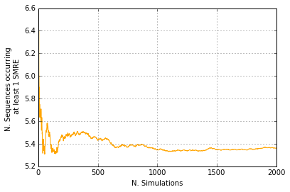

# Promoter analysis
**Jose V. Die**.  

Dpt. Genetics - ETSIAM  
University of Cordoba

<br>

### Outline
1. Search for [occurrences](#Search-for-occurrences) in the actual dataset 
2. Estimate [GC](#Estimating-the-average-GC-content) content
3. Estimate for [occurrences](#Random-promoters-with-at-least-1-regulatory-element) in simulated dataset
4. Estimate [P value](#P-value) for occurrences in the actual dataset

<br>


```python
# set wd for the actual experiment
%cd "/Users/josedie/Desktop/giuseppe/"
```

    /Users/josedie/Desktop/giuseppe


Read the functions needed for the analysis:


```python
import my_functions
```

I will start by reading the set of sequences saved in the file containing the promoter sequences.


```python
# read Promoter sequences
genome = my_functions.readGenome("promotore.fa")
```


```python
! head promotore.fa
```

    
    
    
    
    
    
    
    
    
    


Total number of sequences:


```python
len(genome)
```


    10


  


```python
names = my_functions.nameGenome("promotore.fa")
names
```


    ['LOC101496657 mitoferrin-like',
     'LOC101497299 mitoferrin-like',
     'LOC101504501 zinc finger A20 and AN1 domain-containing stress-associated protein 5-like',
     'LOC101508993 pentatricopeptide repeat-containing protein At1g02150-like',
     'LOC101511666 polygalacturonase QRT2',
     'LOC101511988 actin-related protein 7',
     'LOC101514038 putative disease resistance protein At3g14460',
     'LOC101503954 bidirectional sugar transporter SWEET2-like',
     "UGT79B22 anthocyanidin 3-O-glucoside 2''-O-glucosyltransferase",
     'LOC101510382 proline-rich receptor-like protein kinase PERK9']


<br>

### Search for occurrences


```python
CRE = ['ACCAAAT', 'ACCAACT', 'ACCTAAT', 'ACCTACT', 'ACCAAAC', 'ACCAACC', 'ACCTAAC', 'ACCTACC']
```

The regulatory element is present in some promoters but not in others.


```python
my_functions.search(CRE, genome)
```


    ([2, 2, 2, 3, 4, 5, 7, 8],
     [[885], [379], [916], [774], [860], [1245], [828], [1288]])


```python
# Check
genome[2][885:885+len(CRE[0])]
```


    'ACCAAAT'


```python
'ACCAAAT' in CRE
```


    True


```python
# Check
genome[2][379:379+len(CRE[0])]
```


    'ACCTACT'


```python
'ACCTACT' in CRE
```


    True


```python
# Check
genome[8][1288:1288+len(CRE[0])]
```


    'ACCAAAT'


```python
'ACCAAAT' in CRE
```


    True


However, the regulatory element **is not present** in the following promoters:


```python
my_functions.search(CRE, genome[1])
```


    ([], [])


```python
my_functions.search(CRE, genome[6])
```


    ([], [])


```python
my_functions.search(CRE, genome[9])
```


    ([], [])


```python
my_functions.search(CRE, genome)
```


    ([2, 2, 2, 3, 4, 5, 7, 8],
     [[885], [379], [916], [774], [860], [1245], [828], [1288]])


#### Summary:


```python
my_functions.search(CRE, genome[0])
```


    ([], [])


```python
a, b = my_functions.search(CRE, genome)
occurr = 0
for pos in b :  
    occurr += 1
print len(set(a)), 'promoters with', occurr, 'occurrences'
```

    6 promoters with 8 occurrences


<br>

### Estimating the average GC content 

Now I am going to estimate the average GC content from a set of sequences.  
I have to perform that calculation because I will use the estimate for further analysis. For example, the estimate will be used for Monte Carlo simulations in order to obtain the occurrence and distribution of CREs over a given promoter sequence. 

**Content GC for each sequence**, using the build-in method GC( )


```python
from Bio.SeqUtils import GC
```


```python
# avg GC content for each sequence
for seq in genome: 
    print round(GC(seq),2)
```

    28.1
    28.43
    21.66
    24.5
    19.93
    24.24
    34.03
    33.2
    29.07
    27.83


I want to estimate the total average GC content for my dataset:


```python
gc=[]
for seq in genome: 
    gc.append(GC(seq))
print sum(gc)/len(gc)
```

    27.0990647239


Graphical representation of the GC content for the dataset


```python
%matplotlib inline
import pylab

def plotGC(genome) : 
         ejex=[]
         ejey=[]
         contenido = 0
         for i in range(len(genome)) : 
             ejex.append(i+1)
             contenido +=GC(genome[i])
             mean = contenido/(i+1)
             ejey.append(mean)
         pylab.grid()
         pylab.plot(ejex,ejey, color = "steelblue", lw = 2)
         pylab.axis([0,10,20,30]) #marco dimension de los ejes
         pylab.title("%i Chickpea \n Promoter sequences\nGC%% %0.1f to %0.1f" \
                    % (len(ejey),min(ejey),max(ejey)))
         pylab.xlabel("Number of promoters")
         pylab.ylabel("Content GC%")
        
```


```python
plotGC(genome)
pylab.show()
```


<br>

Estimate % each base in the data set


```python
totalBases = my_functions.countBases(genome)['G'] \
    + my_functions.countBases(genome)['C'] \
    + my_functions.countBases(genome)['A'] \
    + my_functions.countBases(genome)['T'] \
    + my_functions.countBases(genome)['N']

contA = my_functions.countBases(genome)['A'] / float(totalBases)*100
contT = my_functions.countBases(genome)['T'] / float(totalBases)*100
contG = my_functions.countBases(genome)['G'] / float(totalBases)*100
contC = my_functions.countBases(genome)['C'] / float(totalBases)*100

print 'GC content:',contG+contC,'%'
print ''
print 'A content:',contA,'%'
print 'T content:',contT,'%'
print 'G content:',contG,'%'
print 'C content:',contC,'%'
```

    GC content: 27.1997389034 %
    
    A content: 35.1958224543 %
    T content: 37.1148825065 %
    G content: 12.6501305483 %
    C content: 14.5496083551 %


```python

```

La suma no sale 100% porque tengo %pequeño con 'N'. Para ponderar esas 'N' voy a atribuirles la proporcion de cada una de las bases que he encontrado. 'contN'


```python
contN = my_functions.countBases(genome)['N']
contN
```


    75


```python
print 'A content:',(my_functions.countBases(genome)['A'] + contN * contA/100)/float(totalBases)*100,'%'
print 'T content:',(my_functions.countBases(genome)['T'] + contN * contA/100)/float(totalBases)*100,'%'
print 'G content:',(my_functions.countBases(genome)['G'] + contN * contA/100)/float(totalBases)*100,'%'
print 'C content:',(my_functions.countBases(genome)['C'] + contN * contA/100)/float(totalBases)*100,'%'
print ''
print 'GC content:',(my_functions.countBases(genome)['G'] \
                     + contN * contA/100)/float(totalBases)*100 \
                    +(my_functions.countBases(genome)['C'] \
                      + contN * contA/100)/float(totalBases)*100,'%'
```

     A content: 35.3681257627 %
    T content: 37.2871858149 %
    G content: 12.8224338567 %
    C content: 14.7219116635 %
    
    GC content: 27.5443455201 %


```python

```

**Generar un promotor con bases ponderadas**. Usaremos esos valores para definir la siguiente función: **build a promoter using that GC content**.¶


```python
from random import choice

def weightedchoice(items): 
    return choice("".join(x * y for x, y in items))
```


```python
def getPromoter(length):
       '''Genera promotor con bases ponderadas'''
       DNA = ""
       for count in range(length):
            DNA+=weightedchoice([('C',15),('G',13),('A',35),('T',37)])  #AQUI tengo que introducir la freq. de cada base
       return DNA
```

### Random promoters with at least 1 regulatory element


```python
import random
nset = 2000
bp = 1500
actualSet = len(genome)

random.seed(25)
vals3 = my_functions.runSimforOneMotif(CRE, 1500, actualSet, 2000)
```


```python
%matplotlib inline
import pylab
numTrials = 2000 
yAxis = vals3
xAxis = range(1,numTrials+1)
pylab.xlabel('N. Simulations')
pylab.ylabel('N. Sequences occurring \n at least 1 SMRE')
pylab.plot(xAxis, yAxis, color = "orange")
pylab.grid()
pylab.show()
```





**Number of promoters** containing at least 1 SMRE regulatory element just **by chance** over a total of 10 promoters: 


```python
vals3[1999]
```


    5.362


En lugar de estimar en el numero de promotores que deberian haber salido conteniendo al menos 1 motivo, podria estimar del mismo modo el **numero de motivos** que deberian haber salido **por azar**.


```python
random.seed(25)
motiv_random = round(my_functions.estimatedMotif(CRE,1500,2000,actualSet))
```


```python
motiv_random
```


    8.0


<br>

## P value
Por ultimo, vamos a calcular un *P*-value para el numero de promotores que contienen al menos 1 SRME, que hemos encontrado en nuestro data set

cuantas promotores de 1500bp debo tener para encontrar al azar 6 promotores que tengan al menos 1 vez el SRME ?


```python
random.seed(25)
my_functions.getTarget(CRE,1500,6)
```


    7


En lugar de hacerlo una vez, ejecuto la funcion getTarget las veces que quiera simularlo y veo como cambia el resultado.


```python
random.seed(25)
my_functions.runSim(CRE,1500,6,2000)
```

    Sim. 200 ... 8.87
    Sim. 400 ... 8.76
    Sim. 600 ... 8.9
    Sim. 800 ... 8.94
    Sim. 1000 ... 8.96
    Sim. 1200 ... 9.07
    Sim. 1400 ... 9.04
    Sim. 1600 ... 9.0
    Sim. 1800 ... 9.04
    Sim. 2000 ... 9.04
    Average number of tries = 9.048
    P-value= 0.110521662246
    


```python

```

**Nota: usar funcion reload () to make changes effective after editing .py module**


```python
reload(my_functions)
```


    <module 'my_functions' from 'my_functions.pyc'>

